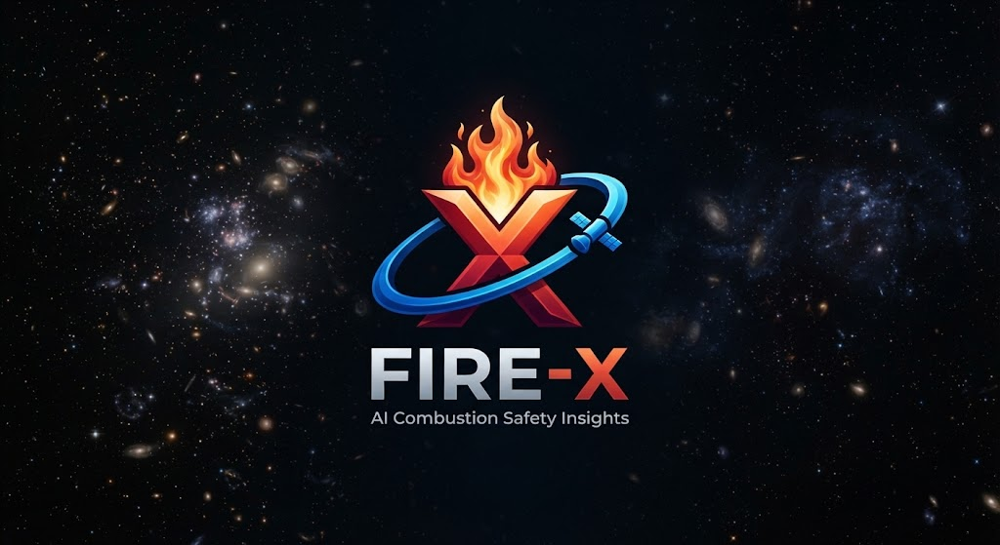

<div align="center">



# FIRE-X
### *AI-Powered Fire Safety Insights from Microgravity Combustion Data*

**Microgravity combustion intelligence meets autonomous retrieval-augmented generation. Instant insights from 442 verified NASA experiments.**

[🌐 Live Demo](#-live-demo) · [⚡ Quick Start](#-quick-start) · [📖 API Reference](#-api-endpoints) · [🛰️ Data Sources](#-data-sources) · [🤖 AI Query](#-ai-query) · [📊 Architecture](#-project-structure)

<p align="center">
  
  
  
  
  
  
</p>

</div>

---

## 🚀 Overview

**FIRE-X** aggregates 442 official NASA microgravity combustion experiments into a unified, high-performance analytics platform. By combining deterministic SQL execution with Google Gemini RAG, FIRE-X transforms complex spacecraft safety datasets into instant, natural-language insights—eliminating manual spreadsheet workflows.

```bash
pip install uv
uv venv .venv -p 3.12 && source .venv/bin/activate
uv pip install -r requirements.txt
uvicorn main:app --host 0.0.0.0 --port 8000 --reload
```

Navigate to `http://localhost:8000` to launch the interactive dashboard.

---

## ✨ Core Features

* **Verified NASA Datasets:** Integrates FLEX-1/2, BASS-II, SAFFIRE-I–VI, ACME/CIR, and NTRS records into a normalized SQLite database.
* **Deterministic RAG Architecture:** The `POST /api/ask-ai` endpoint executes precise SQL queries prior to Gemini synthesis, ensuring completely hallucination-free, data-backed responses.
* **Multi-Experiment Benchmarking:** Side-up configuration panel allowing simultaneous comparison of 2–4 experiments across extinction diameter, O₂ concentration, and burn duration.
* **Planetary Scenario Simulation:** Instant environment toggles between ISS Ambient ($21\\% \\text{O}_2$), Lunar Habitat ($30\\% \\text{O}_2$), and Lunar Hypoxic ($15\\% \\text{O}_2$) safety profiles.
* **Optimized Rendering Engine:** Fully hardened Chart.js lifecycles and GPU rendering safeguards eliminating CPU exhaustion bugs on Linux Wayland window managers.

---

## ⚡ Quick Start

### Prerequisites

| Component | Version Requirement | Installation Reference |
|-----------|--------------------|------------------------|
| **Python** | $3.12+$ | [python.org](https://python.org) |
| **uv** | Latest | `curl -Ls https://astral.sh/uv/install.sh \| sh` |
| **Git** | Standard | `sudo pacman -S git` / `sudo apt install git` |

### Installation & Execution

```bash
# 1. Clone the repository
git clone https://github.com/your-username/FIRE-X.git
cd FIRE-X

# 2. Instantiate isolated virtual environment
uv venv .venv -p 3.12
source .venv/bin/activate

# 3. Install core dependencies
uv pip install -r requirements.txt

# 4. Build the unified canonical database
python scripts/pipeline.py

# 5. Boot the asynchronous backend server
uvicorn main:app --host 0.0.0.0 --port 8000 --reload
```

---

## 📊 Dashboard Architecture

The single-page application (SPA) offers five distinct operational views:

| View Module | Description & Capabilities |
|-------------|----------------------------|
| 🏠 **Home** | Executive KPI cards, O₂ vs. burn time scatter telemetry, and family distribution charts. |
| 🔬 **Explorer** | High-performance data grid featuring keyword search, family filtering, and dynamic parameter sliders. |
| ⚖️ **Compare** | Comparative matrix designed for evaluating up to 4 parallel combustion runs. |
| 🛰️ **Mission** | Scenario-driven evaluations tailored for Deep Space and Lunar habitation protocols. |
| 🤖 **AI Query** | Conversational intelligence layer bridging raw SQL generation with Gemini synthesis. |

---

## 📖 API Endpoints

Base Server URL: `http://localhost:8000`

```http
GET  /api/stats                          → Returns global KPI aggregates and chart mappings
GET  /api/experiments                    → Retrieves paginated, multi-filtered records
GET  /api/experiments/{id}               → Fetches deep-dive telemetry for a single run
POST /api/compare                        → Generates side-by-side array for 2–4 IDs
GET  /api/mission-scenario/{scenario}    → Evaluates iss | lunar_habitat | lunar_hypoxic limits
POST /api/ask-ai                         → Executes secure SQL aggregation + Gemini RAG
```

### Example Payload: AI Query

```bash
curl -X POST http://localhost:8000/api/ask-ai \
  -H "Content-Type: application/json" \
  -d '{"query": "How does oxygen percentage affect PMMA extinction diameter?"}'
```

**JSON Response Schema:**
```json
{
  "sql_result": { "avg_ext_diameter_at_21pct": 18.4, "avg_ext_diameter_at_34pct": 31.2 },
  "ai_answer": "At 34 % O₂ (exploration atmosphere), PMMA droplets reach an average extinction diameter of 31.2 mm — 70 % larger than at standard 21 % O₂ — indicating significantly higher flammability under lunar-habitat conditions."
}
```

---

## 🛰️ Data Governance & Sources

All datasets are derived strictly from publicly archived NASA sources without synthetic data generation:

| Mission Family | Source Repository | Record Count | Operational Focus |
|----------------|------------------|--------------|-------------------|
| **FLEX-1** | NASA PSI-69 | 274 | Liquid droplet combustion, cool-flame dynamics (ISS, 2009–2013) |
| **FLEX-2** | NASA PSI-70 | 10 | Heptane droplet extinction limits (ISS, 2013–2014) |
| **BASS-II** | NASA PSI-25 | 129 | Solid polymer flame propagation (ISS, 2012–2015) |
| **SAFFIRE-I** | NASA PSI-98 | 4 | Full-scale 1 m panel combustion, Cygnus OA-6 (2016) |
| **SAFFIRE-II–VI**| NASA PSI | 15 | Exploration atmosphere validation ($8.2\\text{ psia}$ / $34\\% \\text{O}_2$) |
| **ACME / CIR** | NASA PSI | 8 | Extinction boundaries and electric field effects (ISS) |
| **NTRS** | NASA NTRS | 2 | Historical combustion and safety citations |

---

## 📂 Repository Layout

```text
FIRE-X/
├── main.py                    # Core FastAPI service (7 endpoints + RAG engine)
├── scripts/
│   └── pipeline.py            # Automated ingestion pipeline (6 raw sources → SQLite)
├── frontend/
│   └── index.html             # Responsive SPA dashboard (Chart.js & Tailwind UI)
├── Nasa_data/                 # Raw NASA PSI / NTRS source CSV repositories
├── data/
│   └── processed/
│       └── canonical_experiments.csv   # Normalized 442-row master dataset
├── fire_safety.db             # Production SQLite instance
├── docs/
│   ├── data_dictionary.md     # Schema mapping guide (25 native parameters)
│   └── sources.md             # Official repository links and references
├── requirements.txt
└── README.md
```

---

## ⚙️ Configuration & Environment

| Environment Variable | Default Value | Description |
|----------------------|---------------|-------------|
| `GOOGLE_GENERATIVEAI_API_KEY` | *(Built-in fallback)* | Authorization key for Google Gemini RAG |
| `PORT` | `8000` | Runtime binding port (auto-provisioned by PaaS) |
| `DB_PATH` | `fire_safety.db` | Target path for the SQLite database |

---

## 🤝 Contributing

1. Fork the repository.
2. Establish your feature branch: `git checkout -b feature/system-optimization`.
3. Commit structural adjustments: `git commit -m "perf: optimize sqlite indexing"`.
4. Push changes and open a Pull Request.

---

## 📄 License

Distributed under the [MIT License](LICENSE) — free for modification, academic distribution, and commercial integration.

---

<div align="center">

Developed for **NASA Space Apps Challenge**  
*"Flame in Freefall: AI-Powered Fire Safety Insights from Microgravity Combustion Data"*

🚀 Verified telemetry harvested directly from public **NASA PSI** and **NTRS** archives.

</div>
