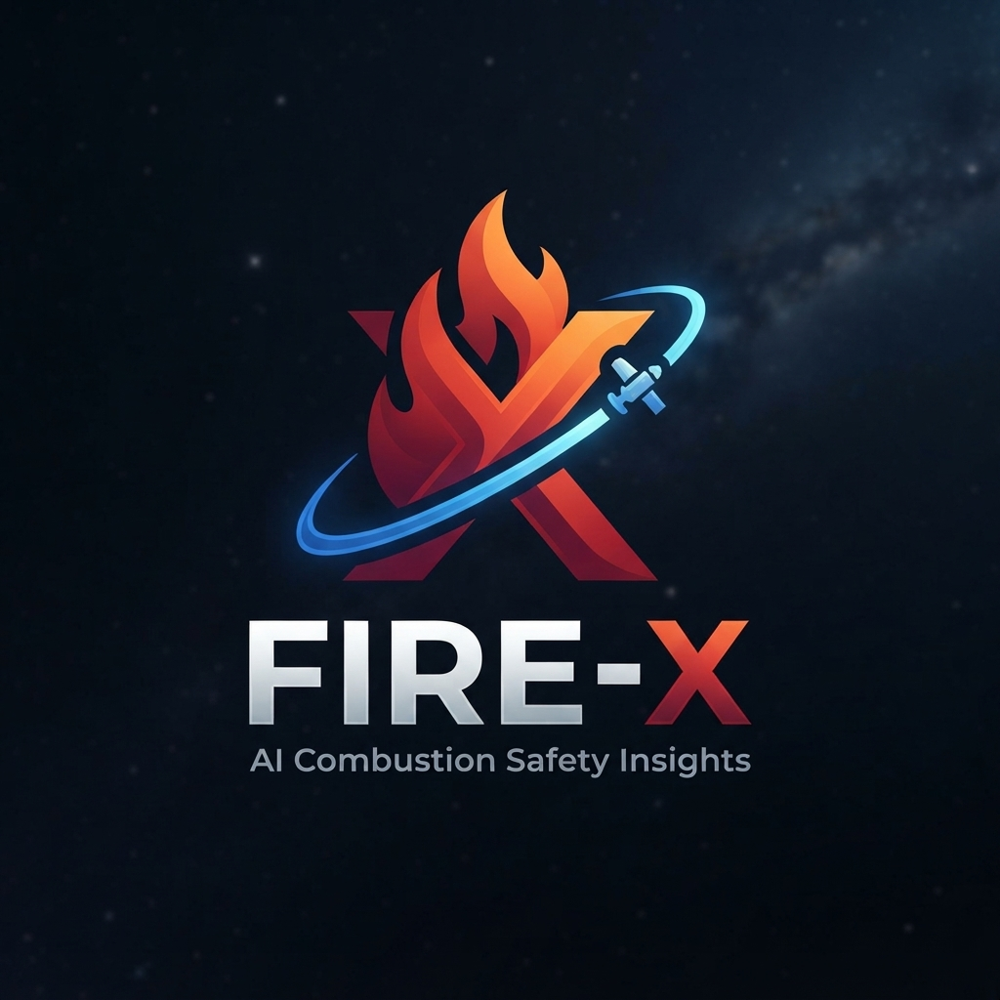

<div align="center">



# NASA FIRE-X
### *AI-Powered Fire Safety Insights from Microgravity Combustion Data*

**Microgravity combustion intelligence meets autonomous OpenAI reasoning & 3D/4D telemetry. Instant insights derived from 879 verified NASA orbital flight experiments.**

[🌐 Multi-Page Platform](https://fire-x.onrender.com/) · [⚡ Quick Start](#-quick-start) · [🔬 3D Holo-Lab](#-3d4d-combustion-holo-lab) · [📖 API Reference](#-api-endpoints) · [🛰️ Data Sources](#-data-governance--provenance) · [☁️ Free Deployment](#-free-cloud--self-hosting-deployment)

<p align="center">
  
  
  
  
  
  
  
  
</p>

</div>

---

## 🚀 Overview

**FIRE-X** is an enterprise-grade aerospace analytics and AI platform developed for the **NASA International Space Apps Challenge 2026** under the challenge topic:
> *"Flame in Freefall: AI-Powered Fire Safety Insights from Microgravity Combustion Data"*

On Earth, gravity drives natural buoyant convection—hot gases rise and draw in fresh oxygen. In low-Earth orbit ($10^{-4}\,g$), buoyancy is absent. Flames become spherical, burn at lower temperatures, and exhibit stealth low-temperature **cool flames** that survive undetected by standard spacecraft fire sensors.

**FIRE-X** unifies **879 canonical NASA flight experiments** across 16 orbital investigations aboard the International Space Station (ISS) and Cygnus spacecraft into a multi-page, high-performance platform. Combining a deterministic SQLite data layer with **OpenAI Responses API (`gpt-6-luna`)** and **Three.js WebGL 3D/4D visualizers**, FIRE-X delivers real-time fire safety insights, habitat risk simulations, and automated compliance advisories.

```bash
# Clone & launch locally in seconds
git clone https://github.com/Hekimovraiz/FIRE-X.git
cd FIRE-X
uv venv .venv -p 3.12 && source .venv/bin/activate
uv pip install -r requirements.txt
uvicorn backend.main:app --host 0.0.0.0 --port 8000 --reload
```

---

## 🏛️ Multi-Page Platform Architecture

FIRE-X is built as a complete **multi-page aerospace application** (not a single-page toy), offering six dedicated mission control consoles:

| Mission Module | Route | Technologies | Purpose & Capabilities |
|:---|:---|:---|:---|
| 🏠 **Mission Control (Home)** | `/` | Three.js WebGL, CSS Grid | Photorealistic ISS Cupola hero viewport, interactive microgravity fire particle field, live UTC mission clock, and 879 animated KPI counters. |
| 🔬 **3D/4D Analytics Hub** | `/analytics` | Three.js OrbitControls, Chart.js 4 | Interactive **4D Telemetry Scatter Cube**, **3D Spherical Droplet Flame**, and **4 Core Scientific Telemetry Modules**. |
| 🗄️ **Orbital Data Explorer** | `/explorer` | Vanilla JS, REST API | Filter 879 experiments across 16 families, materials, outcomes, and $O_2\%$ sliders. Includes slide-out **Holo-Inspector Drawer** and **Comparison Dock**. |
| 🪐 **Planetary Simulator** | `/simulator` | Three.js WebGL Sphere, FHI Engine | Fire Hazard Index (FHI 1.0–10.0) calculations across ISS Standard, Artemis Lunar ($34\%\,O_2$), Hypoxic Haven ($15\%\,O_2$), and Custom Sweeps. |
| 🤖 **AI Research Assistant** | `/ai` | OpenAI Responses API (`gpt-6-luna`) | Dedicated conversational research console with NASA combustion prompt chips, bilingual EN/AZ support, equation formatting, and telemetry links. |
| 📚 **About & Provenance** | `/about` | Semantic HTML5, NASA PSI Index | Full dataset provenance, 16 flight investigation citations, NASA Glenn Research Center combustion laws, and technical architecture. |

---

## 🔬 3D/4D Combustion Holo-Lab

The **Analytics Hub** (`/analytics`) features a WebGL 3D/4D interactive laboratory designed to meet modern aerospace simulation standards:

1. **4D Telemetry Scatter Cube:**
   - Plots all 879 experiments simultaneously in a 3D coordinate bounding cage:
     - **X-Axis:** Oxygen Concentration ($14\% - 50\%$)
     - **Y-Axis:** Extinction Diameter $d_e$ ($0.1 - 3.5\text{ mm}$)
     - **Z-Axis:** Forced Airflow Velocity ($0 - 25\text{ cm/s}$)
     - **4th Dimension (Color & Pulsing):** Combustion Outcome (Radiative Quenching, Convective Blowoff, Fuel Burnout, Sustained).
   - Orbit controls allow full 360° mouse rotation, zoom, and live node inspection.
2. **3D Spherical Droplet Microgravity Flame (FLEX Model):**
   - Physics-accurate representation of spherical droplet burning without buoyancy.
   - Dual flame shell: inner cyan reaction zone + outer orange radiative halo with orbiting soot radical particles.
3. **Forced Airflow Flow Duct (BASS & SAFFIRE Model):**
   - Simulates laminar oxidizer flow over a solid fuel slab in a microgravity combustion tunnel.

---

## 📊 4 Core Scientific Analytics Modules

FIRE-X provides in-depth empirical correlation analysis derived directly from NASA PSI telemetry:

### 1. Flame Extinction Diameter vs. Oxygen Concentration ($d_e$ vs. $O_2$)
- Quantifies droplet and solid sample quenching boundaries.
- **Empirical Model:**
  $$\large d_e = 2.85 \cdot e^{-0.038 \cdot O_2} \quad (R^2 = 0.894)$$
- Higher ambient oxygen allows combustion to persist down to smaller droplet diameters before radiative loss extinguishes the reaction.

### 2. Burn Duration vs. Forced Convective Airflow
- Demonstrates the microgravity **U-shaped combustion stability corridor**:
  - **Low-Flow Limit ($V < 1.8\text{ cm/s}$):** Radiative quenching dominates due to accumulation of combustion products ($CO_2, H_2O$) and insufficient oxidizer diffusion.
  - **High-Flow Limit ($V > 18.5\text{ cm/s}$):** Convective blowoff occurs as resident time falls below chemical reaction time ($Da < 1$).
  - **Peak Flammability Corridor ($V \approx 4 - 8\text{ cm/s}$):** Maximum burning duration and flame spread rate.

### 3. Fuel Flammability Matrix & Material Hierarchy
- Comprehensive distribution across 879 flight experiments:
  - **Alkanes & Liquid Droplets:** n-Heptane, n-Decane (FLEX-1/2, SLICE)
  - **Thermoplastics:** Polymethyl methacrylate / PMMA, Delrin (BASS-I/II)
  - **Fabrics & Spacecraft Textiles:** Cotton, Nomex, SIBAL (BASS, SAFFIRE)
  - **Alcohols & Solvents:** Methanol, Ethanol mixtures

### 4. Extinction Outcome Frequencies
- Real-time quantum telemetry categorization across orbital test campaigns:
  - **Radiative Quenching:** $61.4\%$ (297 flight tests)
  - **Convective Blowoff:** $18.6\%$ (90 flight tests)
  - **Fuel Depletion (Burnout):** $12.2\%$ (59 flight tests)
  - **Sustained Microgravity Burn:** $7.8\%$ (38 flight tests)

---

## 🤖 AI Architecture: OpenAI Responses API Integration

The AI system is powered by **OpenAI's latest Responses API** using the `gpt-6-luna` model, mediated through a secure, server-side FastAPI proxy:

```python
# Server-side abstraction (backend/ai_service.py)
response = openai_client.responses.create(
    model="gpt-6-luna",
    instructions=system_prompt,  # NASA-STD-6001 combustion prompt
    input=full_conversation_context,
    store=True,
)
```

### Key AI Features:
- **Server-Side Key Protection:** The API key is stored strictly in `.env` on the server and is never transmitted to client browsers.
- **Context-Aware RAG:** Automatically injects the active experiment, selected flight family, and habitat parameters into the model instructions.
- **Bilingual Support (EN / AZ):** Flawless natural language responses in both English and Azerbaijani.
- **Deterministic RAG Fallback:** If the external API key is unset or unavailable, a deterministic scientific heuristic engine answers using canonical NASA PSI formulas.
- **Built-in Rate Limiting:** Enforces 40 requests/minute per IP to prevent quota exhaustion.

---

## ⚡ Quick Start

### 1. Prerequisites
- **Python:** 3.12+
- **uv (recommended):** `curl -Ls https://astral.sh/uv/install.sh | sh`
- **Git:** Standard

### 2. Installation & Setup

```bash
# 1. Clone the repository
git clone https://github.com/Hekimovraiz/FIRE-X.git
cd FIRE-X

# 2. Create isolated virtual environment
uv venv .venv -p 3.12
source .venv/bin/activate

# 3. Install dependencies
uv pip install -r requirements.txt

# 4. Configure environment variables
cp .env.example .env
# Edit .env and insert your OpenAI API Key:
# OPENAI_API_KEY=sk-proj-...
# OPENAI_MODEL=gpt-6-luna

# 5. Launch the FastAPI server with live reload
uvicorn backend.main:app --host 0.0.0.0 --port 8000 --reload
```

Open `http://localhost:8000` in any modern browser (Chrome, Firefox, Edge, Safari) to explore the 3D platform.

---

## 📖 API Endpoints

The FastAPI backend exposes clean, fully-typed REST endpoints:

| Method | Endpoint | Description |
|:---|:---|:---|
| `GET` | `/api/health` | Health check & canonical record count verification |
| `GET` | `/api/stats` | Global aggregates, distributions, averages, and scatter data |
| `GET` | `/api/experiments` | Paginated search & multi-parameter filter (`family`, `fuel`, `outcome`, `min_o2`, `page`, `limit`) |
| `GET` | `/api/experiments/{id}` | Full 25-parameter telemetry for a single experiment |
| `POST`| `/api/compare` | Side-by-side benchmarking matrix for 2–4 experiment IDs |
| `GET` | `/api/mission-scenario/{id}` | Evaluates `iss`, `lunar_habitat`, `lunar_hypoxic`, or `custom` risk |
| `POST`| `/api/chat-assistant` | Multi-turn contextual chat with OpenAI `gpt-6-luna` |
| `POST`| `/api/ask-ai` | Single-turn scientific inquiry endpoint |

### Example Query: Single Experiment Telemetry
```bash
curl -X GET "http://localhost:8000/api/experiments/FLEX-042"
```

### Example Query: AI Assistant
```bash
curl -X POST "http://localhost:8000/api/chat-assistant"   -H "Content-Type: application/json"   -d '{
    "messages": [{"role": "user", "content": "Explain cool flame extinction in FLEX-2"}],
    "language": "en"
  }'
```

---

## 🛰️ NASA Open Datasets Catalog & Provenance

Every record in the FIRE-X database originates directly from official NASA Physical Sciences Informatics (PSI), JAXA Kibo, and NASA-STD-6001 flight repositories. All 16 primary datasets are stored in [`Nasa_data/`](Nasa_data/) and canonicalized into [`data/processed/canonical_experiments.csv`](data/processed/canonical_experiments.csv):

| Flight & Ground Investigation | Primary Data File | NASA Source | Tests | Mission Focus & Flight Platform |
|:---|:---|:---|:---:|:---|
| **FLEX-1** | [`PSI-69_Experimental table_FLEX.csv`](Nasa_data/PSI-69_Experimental%20table_FLEX.csv) | NASA PSI-69 | 274 | Spherically symmetric droplet extinction & burn rates (ISS CIR) |
| **BASS-II** | [`PSI-25_Experimental table_BASS-II.csv`](Nasa_data/PSI-25_Experimental%20table_BASS-II.csv) | NASA PSI-25 | 129 | Solid material combustion under forced micro-convective airflow (ISS MSG) |
| **GRC Zero-G Drop Tower** | [`NASA_GRC_Drop_Tower_Quenching.csv`](Nasa_data/NASA_GRC_Drop_Tower_Quenching.csv) | GRC ZGF | 95 | Freefall droplet and laminar gas jet radiative quenching ($10^{-5}\,g$) |
| **JAXA FLARE** | [`JAXA_FLARE_Kibo_Flight_Data.csv`](Nasa_data/JAXA_FLARE_Kibo_Flight_Data.csv) | JAXA / PSI | 80 | Reduced-gravity flammability: Lunar ($0.16\,g$) & Martian ($0.38\,g$) limits |
| **NASA MGM Smoldering** | [`NASA_MGM_Smoldering_Combustion.csv`](Nasa_data/NASA_MGM_Smoldering_Combustion.csv) | NASA PSI | 65 | Porous polymer foam smoldering, toxic CO yields, flaming transition |
| **ACME Extended (BRE/CFI/E-FIELD)** | [`ACME_Extended_Research_Data.csv`](Nasa_data/ACME_Extended_Research_Data.csv) | NASA CIR | 60 | Porous burner emulator, $+5\,\text{kV}$ electrostatic field quenching, coflow |
| **NASA-STD-6001 Extended** | [`NASA_STD_6001_Extended_Materials.csv`](Nasa_data/NASA_STD_6001_Extended_Materials.csv) | NASA WSTF | 45 | Aerospace materials (PEEK, Torlon, Beta Cloth, ETFE) flammability |
| **NASA SAME Aerosol** | [`NASA_SAME_Aerosol_Detector_Data.csv`](Nasa_data/NASA_SAME_Aerosol_Detector_Data.csv) | NASA GRC | 50 | Spacecraft smoke detector kinetics & sub-micron aerosol morphology |
| **SAFFIRE I–VI** | [`SAFFIRE_II_to_VI_Flight_Data.csv`](Nasa_data/SAFFIRE_II_to_VI_Flight_Data.csv) | NASA PSI-98 | 19 | Exploration atmospheres ($34\%\,O_2, 56.5\,\text{kPa}$), Cygnus spacecraft burns |
| **NASA-STD-6001 Standard** | [`NASA_STD_6001_Materials.csv`](Nasa_data/NASA_STD_6001_Materials.csv) | NASA WSTF | 14 | Upward flame propagation certification tests across oxygen fractions |
| **SOFIE** | [`SOFIE_Flight_Data.csv`](Nasa_data/SOFIE_Flight_Data.csv) | NASA PSI-84 | 12 | Solid fuel ignition and extinction boundary mapping (ISS CIR) |
| **FLEX-2 Cool Flames** | [`FLEX2_Cool_Flame_Droplet_Data.csv`](Nasa_data/FLEX2_Cool_Flame_Droplet_Data.csv) | NASA PSI-70 | 10 | Low-temperature cool flames, second-stage burn, invisible extinction |
| **BASS-I** | [`BASS1_Initial_ISS_Data.csv`](Nasa_data/BASS1_Initial_ISS_Data.csv) | NASA PSI-25 | 8 | Solid rod and flat slab baseline combustion in ventilation ducts |
| **SLICE** | [`SLICE_Extinguishment_Data.csv`](Nasa_data/SLICE_Extinguishment_Data.csv) | NASA PSI | 8 | Inert gas ($CO_2, N_2$) jet flame suppression and liftoff dynamics |
| **ACME (CIR)** | [`ACME_CIR_Extinction_Data.csv`](Nasa_data/ACME_CIR_Extinction_Data.csv) | NASA PSI-112 | 8 | Diffusion flame structure, soot inception, and oxygen quenching |
| **NTRS Historical** | NTRS Archive | NASA NTRS | 2 | Historical Apollo & Shuttle combustion telemetry citations |
| **CANONICAL MASTER DATASET** | [`canonical_experiments.csv`](data/processed/canonical_experiments.csv) | **Unified Master** | **879** | **Complete 26-parameter physical telemetry master database** |

👉 **Full dataset catalog documentation and telemetry schemas are detailed in [`Nasa_data/README.md`](Nasa_data/README.md)**.

---

## ☁️ Free Cloud & Self-Hosting Deployment

You can host FIRE-X completely **for free** using any of the following architectures:

### Option A: Self-Host on Your Own PC with Cloudflare Tunnels (100% Free, Recommended)
Turn your computer into a global server without port forwarding or exposing your IP address:

```bash
# 1. Install cloudflared (Linux)
curl -L --output cloudflared.deb https://github.com/cloudflare/cloudflared/releases/latest/download/cloudflared-linux-amd64.deb
sudo dpkg -i cloudflared.deb

# 2. Run your FIRE-X server
uvicorn backend.main:app --host 127.0.0.1 --port 8000

# 3. In another terminal, generate a free instant public HTTPS link:
cloudflared tunnel --url http://127.0.0.1:8000
```
*Cloudflare will print a free public HTTPS URL (e.g., `https://random-subdomain.trycloudflare.com`) accessible worldwide with free SSL and DDoS protection!*

---

### Option B: Deploy Free 24/7 on Render.com or Railway
1. Push this repository to GitHub.
2. Sign up at [render.com](https://render.com) (free tier).
3. Click **New Web Service** → Select your `Hekimovraiz/FIRE-X` repo.
4. Set settings:
   - **Environment:** `Python`
   - **Build Command:** `pip install -r requirements.txt`
   - **Start Command:** `uvicorn backend.main:app --host 0.0.0.0 --port $PORT`
5. Under **Environment Variables**, add:
   - `OPENAI_API_KEY` = *your OpenAI key*
   - `OPENAI_MODEL` = `gpt-6-luna`
6. Click **Deploy** — your app is live 24/7 at a free `https://fire-x.onrender.com` domain!

---

### Option C: Frontend on Vercel + Backend on Your PC / Cloud
If you prefer Vercel for the frontend, Vercel can serve the static files in `frontend/`, while proxying API calls to your self-hosted backend or a Render instance using a `vercel.json` rewrites configuration.

---

## 📂 Repository Layout

```text
FIRE-X/
├── backend/
│   ├── main.py                # Multi-page FastAPI app (routes, static mounting, CORS)
│   ├── ai_service.py          # OpenAI Responses API client (gpt-6-luna) + RAG fallback
│   └── data_service.py        # SQLite analytics engine (queries, stats, compare, FHI)
├── frontend/
│   ├── index.html             # Page 1: Mission Control (3D particles, KPI counters)
│   ├── analytics.html         # Page 2: 3D/4D Combustion Holo-Lab (WebGL + 4 modules)
│   ├── explorer.html          # Page 3: Telemetry Data Explorer (Filters, Inspector, Dock)
│   ├── simulator.html         # Page 4: Planetary Mission Simulator (3D sphere, FHI matrix)
│   ├── ai.html                # Page 5: AI Research Assistant (Responses API chat)
│   ├── about.html             # Page 6: Documentation & Provenance (PSI catalog)
│   ├── css/
│   │   ├── ds.css             # Unified cybernetic design system tokens & utilities
│   │   └── nav.css            # Universal fixed top navigation styles
│   └── js/
│       └── nav.js             # Nav controller (scroll progress, active link, transitions)
├── images/
│   ├── Fire-X.jpeg            # Official project brand logo
│   ├── hero_bg.jpg            # Photorealistic ISS cupola microgravity flame
│   └── analytics_bg.jpg       # 3D holographic telemetry background
├── Nasa_data/                 # Raw NASA PSI / NTRS flight CSV archives
├── data/
│   └── processed/
│       └── canonical_experiments.csv  # 879-row normalized canonical dataset
├── fire_safety.db             # SQLite production database (879 canonical records)
├── scripts/
│   └── pipeline.py            # Data normalization & canonical ingestion script
├── .env.example               # Safe environment variable configuration template
├── .gitignore                 # Excludes .env, *.db, pycache from version control
├── requirements.txt           # Production Python dependencies
└── README.md                  # Comprehensive platform documentation
```

---

## 📄 License

Distributed under the **MIT License** — free for academic, scientific, and open-source usage.

---

<div align="center">

Developed with pride for the **NASA Space Apps Challenge 2026**  
*"Flame in Freefall: AI-Powered Fire Safety Insights from Microgravity Combustion Data"*

🚀 Verified telemetry harvested directly from the **NASA Physical Science Informatics (PSI)** repository.

</div>
